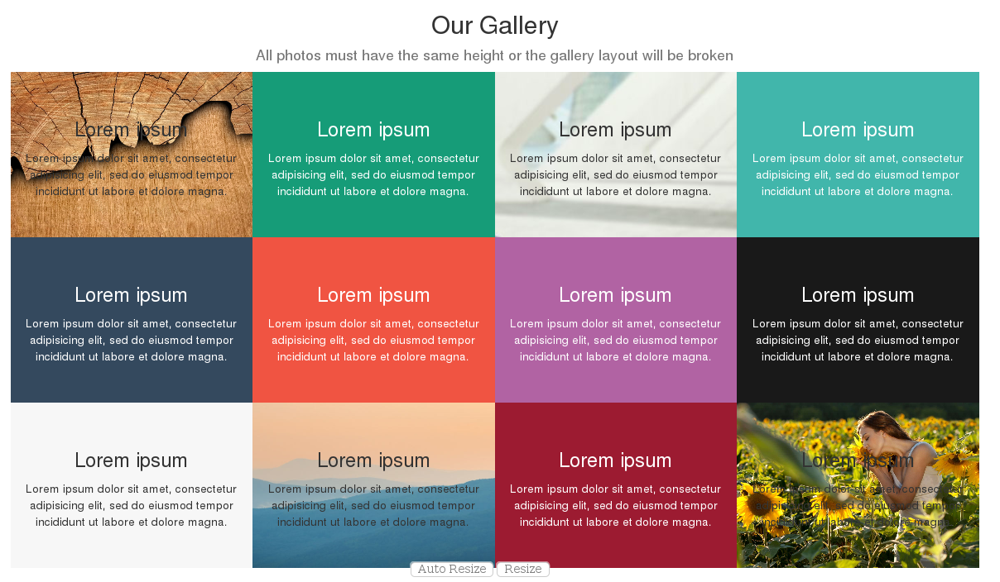

.. image:: https://img.shields.io/badge/licence-AGPL--3-blue.svg
================================================================
    :alt: License: AGPL-3

Marginless Gallery Snippet

This module extends the functionality of the website module to add a new
snippet that forms a marginless gallery and allow you to create a grid of
photos that have no spaces between themselves.

Installation
------------

Configuration
-------------

Usage
-----

-----

-----

-----

=====

To use this module, you need to:

* Edit any page in your website.
* Go to *Insert blocks > Features*.
* Drag the *Marginless Gallery* snippet anywhere in your page.
* Choose a fixed height for all your images. This is required to maintain a
  solid layout. Must be a number.
    * If you still do not want the fixed height (maybe because your theme
      applies it), just leave blank and press *Continue*.

To change images, you need to:

* Select any image block in the snippet you just created.
* Go to *Customize > Background* and choose any background you want.
    * Backgrounds will be centered and cover the whole element in any layout.

To change the images height, you need to:

* Select any block inside the snippet you just created.
* Go to the top parent.
* Go to *Customize > Change Images Height*.
* Input a number and press *Continue*.

To avoid trimming the images, you need to:

* Select any block inside the snippet you just created.
* Go to the top parent.
* Go to *Customize > Do not trim images*.

Known issues / Roadmap
----------------------

* If you do not set a fixed height to all your images in the snippet, it will
  get an ugly layout. Right now we manually set the height, but whenever
  Bootstrap 4 starts being used in Odoo with its flexbox support, this will not
  be needed anymore.

* Improve it using `Masonry <http://desandro.github.io/masonry/>`_ like the
  `Graphene theme  <https://theme-graphene.odoo.com/page/blocks>`_ does. It
  should allow to set arbitrary heights to images with a beautiful layout.

Bug Tracker
-----------

Bugs are tracked on `GitHub Issues <https://github.com/OCA/website/issues>`_.
In case of trouble, please check there if your issue has already been reported.
If you spotted it first, help us smashing it by providing a detailed and
welcomed feedback `here
<https://github.com/OCA/website/issues/new?body=module:%20website_snippet_marginless_gallery%0Aversion:%208.0.1.0.0%0A%0A**Steps%20to%20reproduce**%0A-%20...%0A%0A**Current%20behavior**%0A%0A**Expected%20behavior**>`_.

Credits
-------

[![Odoo Italia Associazione]]

### Contributors

* Jairo Llopis <j.llopis@grupoesoc.es>

### Funders

### Maintainer

.. image:: https://odoo-community.org/logo.png
   :alt: Odoo Community Association
   :target: https://odoo-community.org

This module is maintained by the OCA.

OCA, or the Odoo Community Association, is a nonprofit organization whose
mission is to support the collaborative development of Odoo features and
promote its widespread use.

To contribute to this module, please visit https://odoo-community.org.

[//]: # (copyright)

----

**Odoo** is a trademark of [Odoo S.A.](https://www.odoo.com/) (formerly OpenERP, formerly TinyERP)

**OCA**, or the [Odoo Community Association](http://odoo-community.org/), is a nonprofit organization whose
mission is to support the collaborative development of Odoo features and
promote its widespread use.

**zeroincombenze®** is a trademark of [SHS-AV s.r.l.](http://www.shs-av.com/)
which distributes and promotes **Odoo** ready-to-use on its own cloud infrastructure.
[Zeroincombenze® distribution](http://wiki.zeroincombenze.org/en/Odoo)
is mainly designed for Italian law and markeplace.
Everytime, every Odoo DB and customized code can be deployed on local server too.

[//]: # (end copyright)

[//]: # (addons)

[//]: # (end addons)

